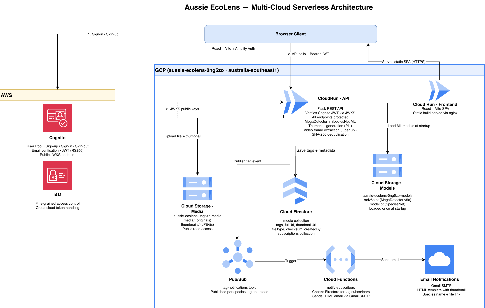

# Aussie EcoLens — Multi-Cloud Architecture

**Two providers:** **AWS** for authentication (Cognito, mandatory) and **GCP** for
everything else (frontend hosting, compute, storage, database, messaging). Every
backend request is authorised by the Flask API verifying the Cognito-issued JWT
against the User Pool's public JWKS — so the GCP project needs no AWS account
access, and the GCP project (unlike an AWS Academy Learner Lab) is shared across
the whole team.

## Components

- **Frontend** — React + Vite SPA with the Amplify `Authenticator`. Built to static
  files and served via **nginx on Cloud Run** (`ecolens-frontend`).
- **Auth** — **AWS Cognito** User Pool: sign-up (first/last name, email, password),
  email verification, login, sign-out; issues RS256 JWTs; exposes a public JWKS.
- **API** — a single **Flask REST API on Cloud Run** (`aussie-ecolens-api`). It
  verifies the Cognito JWT itself on every protected route (via JWKS) — there is
  **no API Gateway**. All upload, search, tag, delete, and notify endpoints live
  in this one service.
- **ML** — MegaDetector v5a (detect animals) → crop → SpeciesNet (classify into 46
  species). Models are loaded **once from a GCS bucket into memory at startup**.
- **Storage** — **Cloud Storage**: a media bucket (originals + thumbnails, public
  read) and a models bucket (`mdv5a.pt`, `model.pt`).
- **Database** — **Firestore**: a `media` collection (tags, file/thumbnail URLs,
  fileType, checksum) and a `subscriptions` collection.
- **Notifications** — **Pub/Sub** topic `tag-notifications` + a **Cloud Function**
  (`notify-subscribers`) that emails watchers via **Gmail SMTP**.

## Request flows

- **Auth:** Browser → Cognito (sign-up, email verify, login) → receives JWT.
- **Every API call:** Browser sends `Authorization: Bearer <ID token>` → the Flask
  API on Cloud Run verifies it against Cognito's JWKS (no gateway in between).
- **Upload → tag (synchronous, in the API):** Browser `POST`s the file (multipart)
  to `/files`. The API computes a SHA-256 checksum (dedup), generates a thumbnail
  (PIL; for video it extracts frames with OpenCV — 1 fps, capped at 10 — and takes
  the peak per-species count), runs MegaDetector + SpeciesNet, stores the file and
  thumbnail in GCS, writes tags + URLs + metadata to Firestore, and publishes a tag
  event to Pub/Sub.
- **Query:** API endpoints read Firestore and apply the logical-AND + minimum-count
  logic, returning thumbnail + full URLs (also: resolve-thumbnail, search-by-file —
  which detects tags on the uploaded file *without storing it* — bulk tag edit, delete).
- **Notify:** the Pub/Sub event triggers the `notify-subscribers` Cloud Function,
  which checks Firestore for users watching the tag and emails them via Gmail SMTP.

## Component → cloud mapping

| Component | Cloud | Service |
| --- | --- | --- |
| Frontend hosting | GCP | Cloud Run (static React bundle via nginx) |
| Authentication | **AWS** | Cognito User Pool + App Client |
| REST API (auth-verify, upload, search, tag, delete, notify) | GCP | Cloud Run (Flask) |
| ML tagging + thumbnails + video frames | GCP | runs inside the Flask Cloud Run service (MegaDetector + SpeciesNet, PIL, OpenCV) |
| Object storage (uploads, thumbnails, models) | GCP | Cloud Storage |
| Database | GCP | Firestore |
| Notifications | GCP | Pub/Sub topic + `notify-subscribers` Cloud Function (Gmail SMTP) |
| Container registry | GCP | Artifact Registry |

## Why this satisfies the rubric

- **Multi-cloud:** AWS (Cognito) + GCP (everything else) — official icons for both.
- **Model Handling 4.1:** model weights live in GCS and are loaded at Cloud Run
  startup → swap a model by replacing it in GCS and restarting; no code change.
- **Auth & access control:** the Flask API rejects any request without a valid
  Cognito JWT (verified via JWKS); the frontend blocks all routes except login.
  Cross-cloud trust is the JWT/JWKS verification, not shared credentials.
- **Shareability:** the GCP project is shared with all teammates (IAM members),
  solving the "Learner Labs can't be shared" problem.
